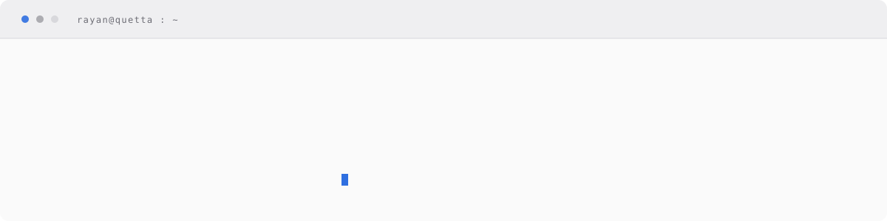

 

### Stack

### Selected work

<table>
  <tr>
    <td width="50%">
      
    </td>
    <td width="50%">
      
    </td>
  </tr>
  <tr>
    <td width="50%">
      
    </td>
    <td width="50%">
      
    </td>
  </tr>
  <tr>
    <td width="50%">
      
    </td>
    <td width="50%">
      
    </td>
  </tr>
</table>

### Signal

<picture>
  <source media="(prefers-color-scheme: dark)" srcset="https://raw.githubusercontent.com/rayan007-bond/rayan007-bond/output/github-snake-dark.svg" />
  <source media="(prefers-color-scheme: light)" srcset="https://raw.githubusercontent.com/rayan007-bond/rayan007-bond/output/github-snake.svg" />
  
</picture>

[LinkedIn](https://www.linkedin.com/in/muhammad-rayan-519197256) &nbsp;·&nbsp;
[Medium](https://medium.com/@muhammadrayan182) &nbsp;·&nbsp;
[Instagram](https://instagram.com/muhmmad_rayan171) &nbsp;·&nbsp;
[Facebook](https://facebook.com/muhammad.rayan.10004)

